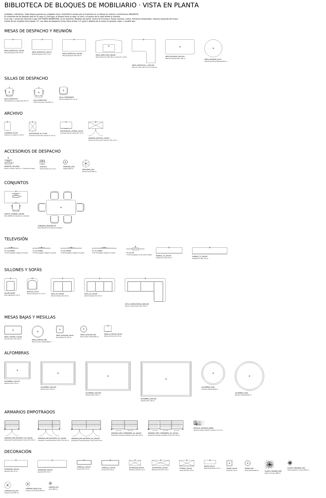
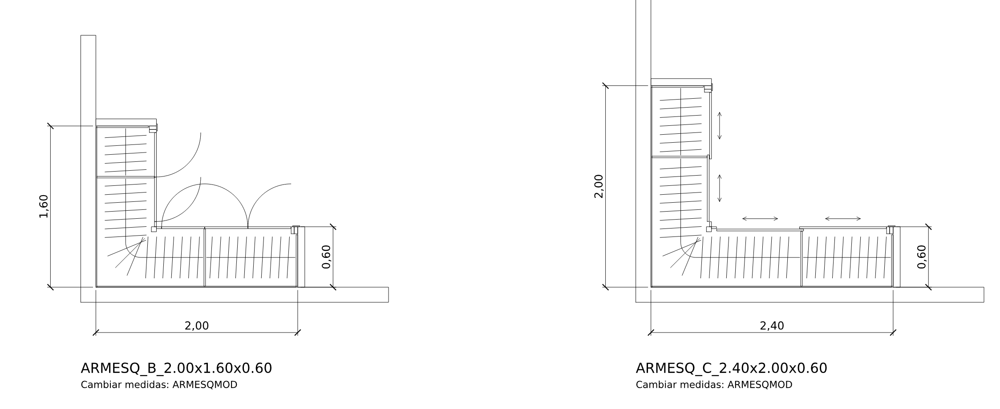
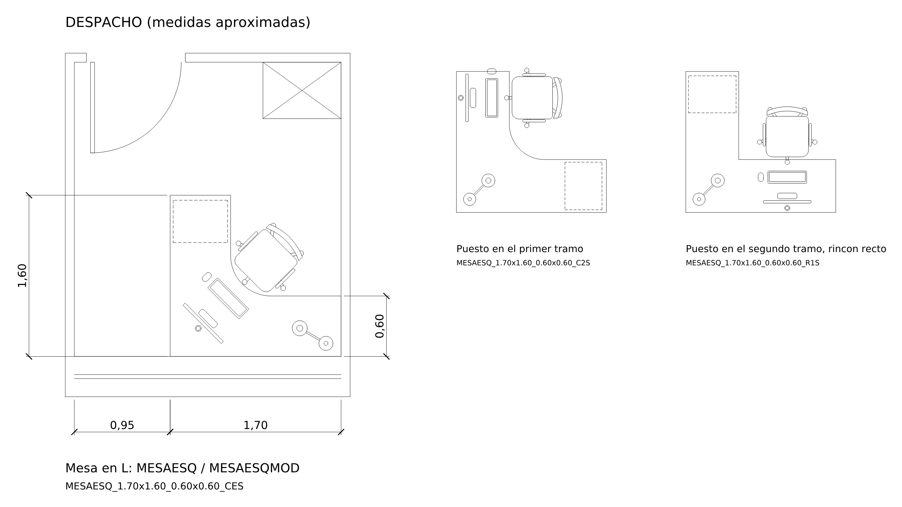
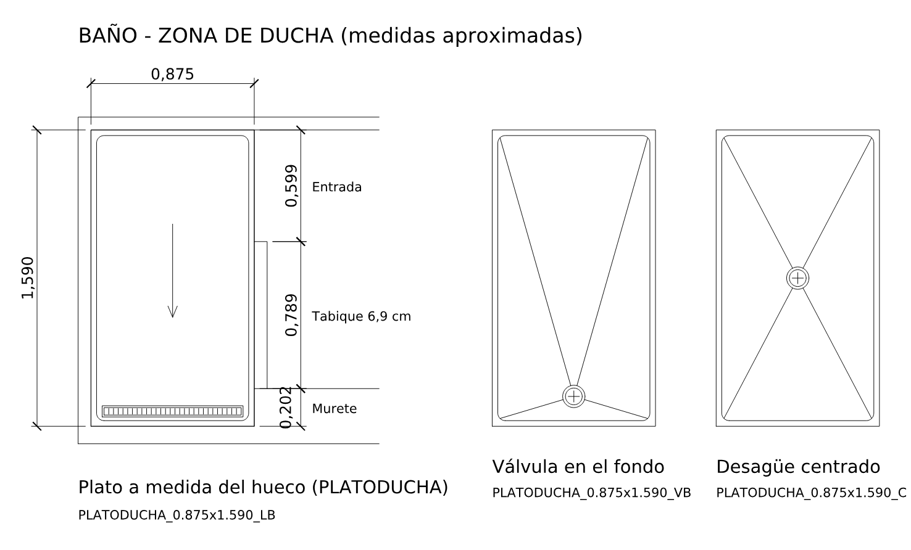

# Bloques de mobiliario en planta

`BloquesMobiliarioPlanta.dxf` es una biblioteca de 64 bloques de mobiliario en vista en planta, dibujados a tamaño real en milímetros (DXF de AutoCAD 2010). El espacio modelo trae un catálogo con todos los bloques rotulados.



## Cómo usarla

1. Abre el DXF en AutoCAD y guárdalo como DWG (`GUARDARCOMO` o `_SAVEAS`).
2. Inserta los bloques en tu plano de una de estas formas:
   - **DesignCenter** (Ctrl+2 o `_ADCENTER`): busca el DWG, entra en *Bloques* y arrástralos al dibujo.
   - **Paleta Bloques** (`_INSERT`, AutoCAD 2020 o posterior), pestaña *Bibliotecas*: elige el DWG.
   - Copiar y pegar desde el catálogo. En ese caso, cámbiales después la capa `CAT-BLOQUES` por la tuya.

## Convenciones

- **Capa 0 y PorCapa.** El bloque toma la capa, el color y el grosor de la capa donde lo insertas.
- **Unidades.** Cada bloque guarda sus unidades de inserción (mm). Si tu dibujo tiene sus unidades definidas (`UNIDADES`, *Unidades de inserción* en metros o centímetros), AutoCAD escala el bloque solo. Si tu dibujo está *sin unidades*, escálalo a mano: ×0,001 para metros y ×0,1 para centímetros.
- **Punto de inserción** (cruz roja del catálogo, capa que no se imprime):
  - muebles contra pared: centro de la trasera;
  - piezas exentas (mesas bajas, alfombras, plantas, mesa de dirección y de reuniones): centro;
  - armarios empotrados: esquina izquierda del hueco, en el plano de la pared.
- **Orientación.** Frente de los muebles hacia abajo (-Y). Las sillas de despacho miran hacia arriba (+Y), así que van delante de las mesas sin girarlas.
- **Aspa (X)** dentro de un mueble: mueble alto.

## Bloques

| Grupo | Bloques |
|---|---|
| Mesas | `MESA_DESPACHO_120x60`, `_140x70`, `_160x80`, `MESA_DIRECCION_180x90`, `MESA_DESPACHO_L_160x160`, `MESA_REUNION_200x100`, `MESA_REUNION_D120` |
| Sillas de despacho | `SILLA_OPERATIVA`, `SILLA_DIRECCION`, `SILLA_CONFIDENTE` |
| Archivo | `CAJONERA_42x58`, `ARCHIVADOR_4C_47x62`, `ARCHIVADOR_LATERAL_80x45`, `ARMARIO_ARCHIVO_100x45` |
| Accesorios | `MONITOR_TECLADO`, `PORTATIL`, `PAPELERA_D30`, `PERCHERO_D50` |
| Conjuntos | `PUESTO_TRABAJO_160x80`, `CONJUNTO_REUNION_6P` |
| Televisión | `TV_43_PARED`, `TV_55_PARED`, `TV_65_PARED`, `TV_75_PARED`, `TV_55_PIE`, `MUEBLE_TV_180x40`, `MUEBLE_TV_240x45` |
| Sillones y sofás | `SILLON_85x85`, `BUTACA_70x75`, `SOFA_2P_160x90`, `SOFA_3P_210x90`, `SOFA_CHAISELONGUE_280x160` |
| Mesas bajas | `MESA_CENTRO_120x60`, `MESA_CENTRO_D80`, `MESA_AUXILIAR_50x50`, `MESA_AUXILIAR_D45`, `MESILLA_NOCHE_50x40` |
| Alfombras | `ALFOMBRA_120x170`, `_160x230`, `_200x300`, `_240x340`, `ALFOMBRA_D160`, `ALFOMBRA_D200` |
| Armarios empotrados | `ARMARIO_EMP_BATIENTE_2H_100x60`, `_3H_150x60`, `_4H_200x60`, `ARMARIO_EMP_CORREDERA_2H_180x60`, `_3H_240x60`, `DETALLE_ARMARIO_JAMBA` |
| Decoración | `APARADOR_160x45`, `APARADOR_200x50`, `CONSOLA_100x30`, `CONSOLA_120x35`, `ESTANTERIA_80x35`, `ESTANTERIA_120x35`, `VITRINA_100x40`, `BALDA_80x25`, `PEANA_40x40`, `PEANA_D40`, `PLANTA_GRANDE_D80`, `PLANTA_PEQUENA_D40`, `LAMPARA_PIE_D45`, `LAMPARA_MESA_D30`, `JARRON_D20` |

Los armarios empotrados incluyen tapajuntas, premarco, cerco, casco, divisiones, puertas con su barrido (o correderas con sus flechas), barra y perchas. `DETALLE_ARMARIO_JAMBA` es la sección horizontal de la jamba a tamaño real, con rótulos de 12,5 mm (2,5 mm impresos a E 1:5).

## Armario empotrado en esquina con medidas editables (`ArmarioEsquina.lsp`)

Dibuja en planta un armario empotrado en esquina de 90° con todo el detalle: casco (traseras, costados y divisiones), frente (tapajuntas, premarco, cerco, poste de rincón y regletas), puertas batientes con su barrido o correderas en dos guías, barra de colgar en L en el rincón y perchas. Trabaja en metros; si el dibujo tiene las unidades en centímetros o milímetros (`INSUNITS`), se escala solo.

1. Carga el archivo con `APPLOAD` (o arrástralo a la ventana de AutoCAD).
2. `ARMESQ`: pincha la esquina interior de las paredes y, después, el final del armario en cada pared (o mueve el cursor en esa dirección y teclea el largo). Luego indica el fondo (0,60 por defecto) y el tipo de puertas. Si la segunda pared queda a la derecha de la primera, el armario sale simétrico.
3. `ARMESQMOD`: selecciona un armario ya insertado y cambia el largo de cada lado, el fondo o las puertas. Se redibuja entero, sin mover la inserción.

Cada combinación de medidas es un bloque propio (por ejemplo `ARMESQ_B_2.00x1.60x0.60`: B = batientes, C = correderas; largo en la primera pared x largo en la segunda x fondo). Las medidas se guardan en la inserción, por eso `ARMESQMOD` las recupera. Las puertas se reparten solas: hojas batientes de 60 cm como máximo (la del rincón abre hacia fuera del rincón para no chocar con el otro frente) o correderas de 1 m como máximo.

`ArmarioEsquina_ejemplo.dxf` trae dos armarios ya dibujados en metros (2,00 x 1,60 batiente y 2,40 x 2,00 corredero). Con el LISP cargado, `ARMESQMOD` también funciona sobre ellos.



## Mesa de escritorio en L con silla y complementos (`MesaEsquina.lsp`)

Dibuja en planta una mesa en L con el rincón interior curvo o recto, pasacables, el puesto de trabajo completo (pantalla con su pie, teclado, ratón a la derecha y silla operativa con ruedas), lámpara de mesa y cajonera bajo el tablero en discontinua. La discontinua está dibujada a trazos, así que se ve igual con cualquier escala de tipo de línea. Trabaja en metros y se escala sola en dibujos en centímetros o milímetros.

1. Carga el archivo con `APPLOAD`.
2. `MESAESQ`: pincha la esquina exterior de la L y el final de cada tramo (o teclea el largo con la dirección del cursor). Luego da el fondo de cada tramo (0,60 por defecto) y las opciones:
   - **Puesto de trabajo**: en la *Esquina* (silla en el rincón, mirando a la esquina), en el *Primero* o en el *Segundo* tramo.
   - **Rincón interior**: *Curvo* (radio de hasta 40 cm, según el espacio) o *Recto*.
   - **Silla**: *Sí* o *No*.
3. `MESAESQMOD`: selecciona una mesa ya insertada y cambia largos, fondos u opciones. Se redibuja entera sin moverse.

Da igual el orden en que pinches los tramos: si el segundo queda a la derecha del primero, el comando los intercambia para que el bloque no salga en simetría y el ratón siga a la derecha. Cada combinación de medidas y opciones es un bloque propio (por ejemplo `MESAESQ_1.70x1.60_0.60x0.60_CES`), y las medidas quedan guardadas en la inserción para `MESAESQMOD`.

`MesaEsquina_ejemplo.dxf` trae el despacho de la captura con medidas aproximadas (2,65 x 2,92 m, deducidas de la mesa de 160 x 80 que había dibujada) y la mesa en L colocada como en el croquis: un tramo de 1,60 m perpendicular a la ventana y otro de 1,70 m junto a la ventana hasta la pared derecha, con el puesto en el rincón. Al lado hay dos variantes con el puesto en cada tramo.



## Plato de ducha a medida del hueco (`PlatoDucha.lsp`)

Dibuja en planta un plato de ducha que ocupa justo el hueco que pinches: borde, reborde interior con las esquinas redondeadas y desagüe centrado, de válvula junto a un lado o lineal a lo largo de un lado, con sus líneas de pendiente. La escala (m, cm o mm) se deduce del tamaño del hueco, así que funciona aunque `INSUNITS` no coincida con las unidades en que dibujas.

1. Carga el archivo con `APPLOAD`.
2. `PLATODUCHA`: pincha dos esquinas opuestas del hueco, en las caras interiores de las paredes y del tabique (usa la referencia a objetos *Punto final* o *Intersección*). Después pincha cerca del lado donde quieres el desagüe, o pulsa Intro para dejarlo centrado, y elige *Valvula* o *Lineal*.
3. `PLATODUCHAMOD`: selecciona un plato ya insertado y cambia el ancho, el largo, el tipo de desagüe o su lado. La esquina de inserción no se mueve.

Cada combinación es un bloque propio (por ejemplo `PLATODUCHA_0.879x1.595_LA`: L = lineal, V = válvula, C = centrado; A, B, I o D = lado de arriba, abajo, izquierda o derecha) y las medidas quedan guardadas en la inserción para `PLATODUCHAMOD`. Los lados de 0,60 a 3,00 m son válidos.

`PlatoDucha_ejemplo.dxf` trae la zona de ducha del baño de la captura, con medidas aproximadas deducidas del tabique de 6,9 cm: un hueco de unos 0,88 x 1,59 m cerrado a la derecha por el murete, el tabique y la entrada. El plato está insertado con `PLATODUCHA` y lleva el desagüe lineal en el fondo, lejos de la entrada. Al lado hay dos variantes, con válvula y con el desagüe centrado.



## Regenerar o modificar

Las medidas están en `generar_bloques.py`. Para volver a generar el DXF:

```
pip install ezdxf
python3 generar_bloques.py
```
